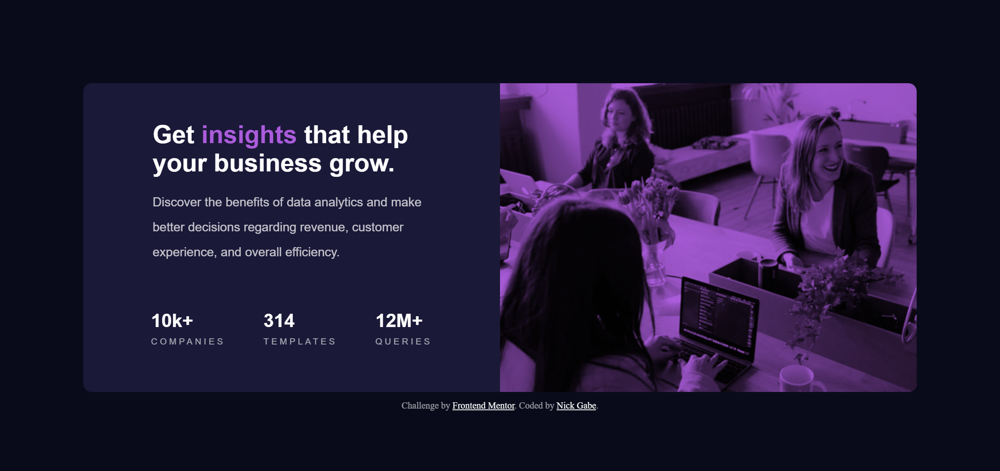

# Frontend Mentor - Stats preview card component solution

This is a solution to the [Stats preview card component challenge on Frontend Mentor](https://www.frontendmentor.io/challenges/stats-preview-card-component-8JqbgoU62). Frontend Mentor challenges help you improve your coding skills by building realistic projects. 

## Table of contents

- [Overview](#overview)
  - [The challenge](#the-challenge)
  - [Screenshot](#screenshot)
  - [Links](#links)
- [My process](#my-process)
  - [Built with](#built-with)
  - [What I learned](#what-i-learned)
  - [Continued development](#continued-development)
- [Author](#author)

## *Overview*……………………………………………………

### The challenge

Users should be able to:

- View the optimal layout depending on their device's screen size

### Screenshot

### Links

- Solution URL: [Add solution URL here](https://your-solution-url.com)

## *My process*…………………………………………………

## Analyzing first
I started by looking at the image and figuring out what parts of the css could be generic and applied to all of the screen sizes, then I started with the HTML, trying to keep the markup most semantic as possible.

I prefer the mobile-first workflow, since in mobile things tend to be more simplistic and it's easier to complexify something simple than it is to simplify something complex. My next step was defining css global variables like the color pallette and a font-size, and just then start the "real" css by creating the generic styles for the classes and tags, you can see the result on this image, and yes it stills really awkward 😅.

And after finishing the primordial stuff, there are several things to change for more specific elements, like:
* Because the images for mobile and desktop are different sizes, the `<picture>` tag is presuming its height from the bigger image and making the smaller image have a bar below.
* Nothing is aligned.
* The list is not even readable yet.

So I worked to fix these, starting from the top to the bottom, and managed to finish the mobile version while also thinking in ways to make the tablet look good aswell, and after liking both, I ended up with this for desktop:

It's not bad I guess, but it's so stretched, I can barely understand the image and the text is distributed in the screen, so I started making the css for desktop while analyzing again the challenge design. And after some changes I managed to get the final result:

### Built with

- Semantic HTML5 markup
- CSS custom properties
- Flexbox
- CSS Grid
- Mobile-first workflow
- Custom Fonts

### What I learned
Im going to be honest, but in this specific case I really struggled with class names 😂. But it was also the first time I have ever used the `<picture>` tag and also tried to use different measures for different purposes like `px`, `rem`, `ch`, `vh`.

### Continued development

Im kind of new to the front-end, so Im still getting used to classes, tags and more, but I love learning, doing projects and challenges, so in the future I really hope I will get better at those things.

## *Author*…………………………………………………………

- Frontend Mentor - [@Nick-Gabe](https://www.frontendmentor.io/profile/Nick-Gabe)
- GitHub - [@Nick-Gabe](https://github.com/Nick-Gabe/)
- Twitter - [@MyNickIsNick_](https://www.twitter.com/MyNickIsNick_)